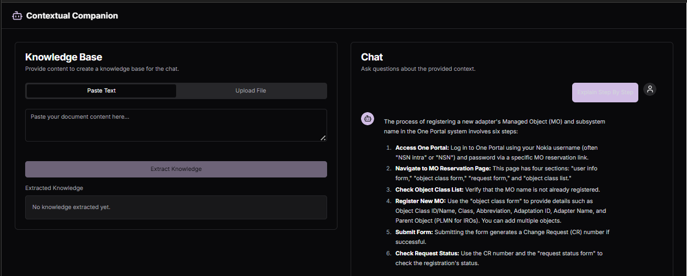

# Contextual Companion: Your AI-Powered RAG Chatbot



**Contextual Companion** is an intelligent, full-stack web application that leverages Retrieval-Augmented Generation (RAG) to answer questions about any document you provide. Simply upload a file or paste text, and our AI-powered assistant will extract the key knowledge and engage in a contextual conversation with you.

This project was built to demonstrate the power of combining modern web technologies like Next.js with advanced AI capabilities from Google's Gemini models through the Genkit framework.

## ✨ Key Features

- **Dynamic Knowledge Base:** Upload `.txt` or `.md` files, or paste raw text to create a contextual knowledge base on the fly.
- **Intelligent Knowledge Extraction:** An AI agent analyzes the provided content and synthesizes a comprehensive summary.
- **Conversational Chat Interface:** Ask questions in natural language and receive context-aware answers based on the document.
- **Chat History:** Conversations are saved and associated with a session, allowing you to pick up where you left off.
- **Responsive Design:** A clean, modern UI that works seamlessly across desktop and mobile devices.
- **Dark & Light Modes:** Switch between themes for your viewing comfort.
- **Code-Friendly:** Displays code snippets with syntax highlighting and a one-click copy button.

## 🚀 Tech Stack

- **Framework:** [Next.js](https://nextjs.org/) (App Router)
- **Language:** [TypeScript](https://www.typescriptlang.org/)
- **AI & Generative AI:** [Genkit](https://firebase.google.com/docs/genkit) with [Google's Gemini API](https://ai.google.dev/)
- **UI:** [React](https://react.dev/)
- **Styling:** [Tailwind CSS](https://tailwindcss.com/)
- **Component Library:** [ShadCN UI](https://ui.shadcn.com/)
- **Database:** [MongoDB](https://www.mongodb.com/) (for storing chat history)
- **Deployment:** Ready for [Firebase App Hosting](https://firebase.google.com/docs/hosting)

## 🛠️ Getting Started

Follow these instructions to get a copy of the project up and running on your local machine for development and testing purposes.

### Prerequisites

- [Node.js](https://nodejs.org/en) (v18 or later)
- [npm](https://www.npmjs.com/) or [yarn](https://yarnpkg.com/)
- A [MongoDB Atlas](https://www.mongodb.com/cloud/atlas) account or a local MongoDB instance.
- A [Google AI API Key](https://ai.google.dev/gemini-api/docs/api-key) for Gemini.

### Installation & Setup

1.  **Clone the repository:**
    ```bash
    git clone https://github.com/your-username/contextual-companion.git
    cd contextual-companion
    ```

2.  **Install dependencies:**
    ```bash
    npm install
    ```

3.  **Set up environment variables:**
    Create a `.env` file in the root of the project and add the following variables. Replace the placeholder values with your actual credentials.

    ```env
    # Your MongoDB connection string
    MONGODB_URI="mongodb+srv://<user>:<password>@<cluster-url>/<database-name>?retryWrites=true&w=majority"

    # Your Google AI API Key for Gemini
    GEMINI_API_KEY="your-gemini-api-key"
    ```

### Running the Application

1.  **Start the development server:**
    ```bash
    npm run dev
    ```

2.  **Open your browser:**
    Navigate to [http://localhost:3000](http://localhost:3000) to see the application in action.

## 🤖 AI & Genkit

This project uses **Genkit**, an open-source framework from Google, to streamline the development of AI-powered features.

- **`knowledge-extraction.ts`:** This flow defines an AI agent that takes raw text content as input and extracts a structured, comprehensive summary.
- **`intelligent-responses.ts`:** This flow powers the chat functionality. It uses the extracted knowledge and chat history as context to provide relevant and accurate answers to user questions, falling back on its general knowledge when the context is insufficient.

The prompts are designed to be robust, with retry logic and fallback models to ensure a reliable user experience.
